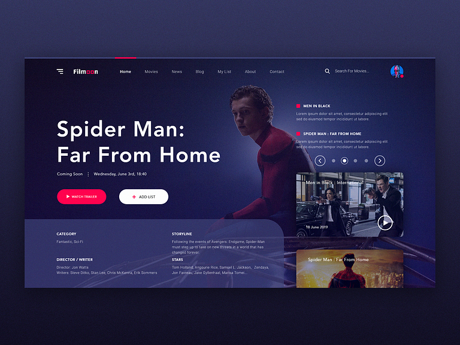
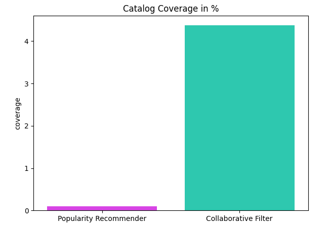
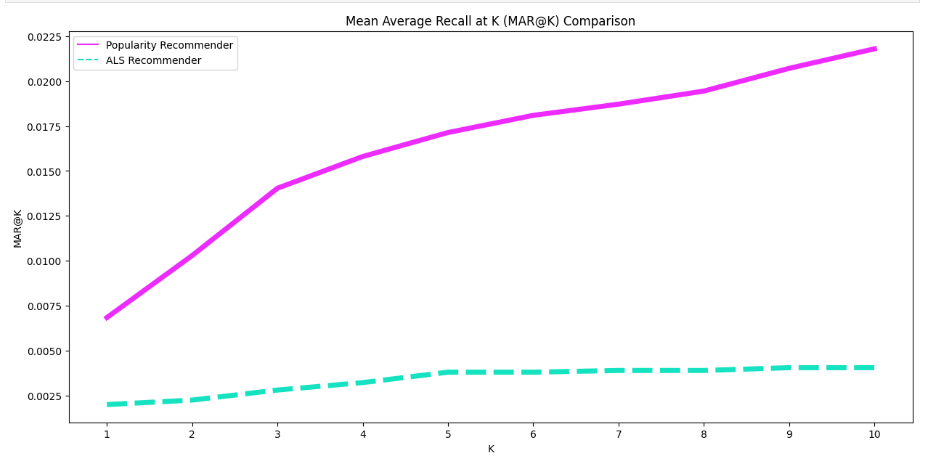

# FilmCraze Recommender

"Here's looking at you, kid." - Rick Blaine, Casablanca (1942)



# Business Understanding 

In the ever-expanding world of entertainment, finding the perfect movie can be a daunting task. Our project, FilmCraze Recommender, is designed to simplify this process by leveraging cutting-edge recommendation algorithms. This not only enhances the viewing experience for users but also provides higher revenue and user engagement for content creators and streaming platforms.

## Value Proposition


1. **End Users (Viewers)**: Enjoy tailored recommendations.
2. **Streaming Platforms**: Boost user engagement and subscription rates.
3. **Content Creators**: Gain insights for content and marketing strategies.

# Data Understanding 

## Data Source: 
The dataset utilized for this project is the MovieLens dataset, a well-established and widely recognized dataset in the field of movie recommendations. MovieLens is acclaimed for its extensive collection of user interactions and comprehensive movie metadata.find it here [here](https://grouplens.org/datasets/movielens/)
## Data Characteristics:

1. **Size**: The dataset consists of 100,836 records.
2. **Features**: It contains 4 features.
3. **Quality**: The data contains missing values and duplicates, which need to be addressed during preprocessing.
4. **Suitability**:
Rich user interactions: Ratings, tags, user profiles.
Proven in academia and industry for recommendation systems.

# Data Preparation

1. **Handle Missing Values**: Removed rows with missing values in the 'tmdbId' column.

2. **Data Type Conversion**: Changed the data type of the 'tmdbId' column from float to int for compatibility with the 'fetch_poster' function.

3. **Remove Duplicates**: Dropped duplicate rows, keeping the first occurrence.

4. **Column Name Standardization**: Renamed column names to lowercase for alignment with PostgreSQL columns.

The data is now ready for use.


# Recommendation Models

## 1. Baseline Popularity-Based Model

- **Overview:** Simple, popularity-driven model.
- **How it Works:** Recommends popular movies to all users.
- **Pros:** Easy to implement.
- **Cons:** Lacks personalization.

I used this model as baseline model and improved from it
## 2. Cosine Similarity-Based Model

- **Overview:** Focuses on user-item similarity.
- **How it Works:** Recommends items similar to a user's preferences.
- **Pros:** Provides personalized recommendations.
- **Cons:** Needs user-item interaction data.

I have used this model in my recommendation part of my website
## 3. Alternating Least Squares (ALS) Model

- **Overview:** Collaborative filtering with latent factors.
- **Pros:** Strong personalization, effective for sparse data.
- **Cons:** Requires sufficient interaction data.

I used this model as the final model and used it in For You part of my website 

# Model Evaluation

## Evaluation

We rigorously evaluate the performance of our recommendation system using various metrics to ensure its effectiveness and reliability in delivering personalized movie recommendations.

### Key Metrics

- **Novelty**: We assess the novelty of our recommendations to provide users with unique and engaging content.

- **Personalization**: We prioritize personalization to tailor recommendations to individual user tastes and preferences.

- **Coverage**: Our system aims to cover a broad range of movies to cater to diverse user preferences.

- **Mean Average Recall at K (MAR@K)**: This metric measures the effectiveness of our recommendations at different values of K, ensuring we are delivering relevant items to users.

### Results

- **Novelty**: Our recommendations exhibit a novelty score of 2.74, striking a balance between uniqueness and user engagement.

- **Personalization**: "We achieve a moderate level of personalization, with a personalization score of 0.05.".


- **Coverage**: Our system achieves an impressive catalog coverage of 44%, offering a wide variety of movies to our users.


- **MAR@K**: Our model achieves a lower MAR@K score, which can be influenced by the prevalence of popular items. While this may lead to seemingly strong performance, it may not fully reflect the model's ability to provide personalized and useful recommendations.


Our evaluation results underscore the effectiveness of our recommendation system in delivering a superior movie-watching experience for end-users while providing value to streaming platforms and content creators.
For detailed analysis, data exploration, and modeling code, please refer to the provided student notebook available in the [student notebook](https://github.com/u-mar/Recommender/blob/main/student.ipynb).

## Presentation Link 
Link:[presentation](https://github.com/u-mar/Recommender/blob/main/Presentationr.pdf).


## Usage

1. **Installation**

    ```bash
    git clone https://github.com/yourusername/filmcraze-recommender.git
    ```

2. **Getting Started**

    ```bash
    pip install -r requirements.txt
   ```
   ```bash
    cd filmcraze-recommender
    ```

3. **Setting Up a Local PostgreSQL Database**

    To use FilmCraze Recommender, you'll need a PostgreSQL database to store and retrieve movie data. Here's how to set it up:

    - **Install PostgreSQL**: If you haven't already, download and install PostgreSQL from the official website: [PostgreSQL Downloads](https://www.postgresql.org/download/).

   - **Database Configuration**: Update the database configuration in your project. Open the `app.py` and fill in your database credentials:

        ```python
        DB_HOST = 'localhost'
        DB_NAME = 'filmcraze_db'
        DB_USER = 'your_postgres_username'
        DB_PASSWORD = 'your_postgres_password'
        ```


4. **Running the Recommender**

    ```bash
    python app.py
    ```


5. **Feedback and Support**

    If you have any questions, feedback, or need support, please feel free to [contact us](mailto:cumarmustaf0757@gmail.com) or open an issue on this repository.
